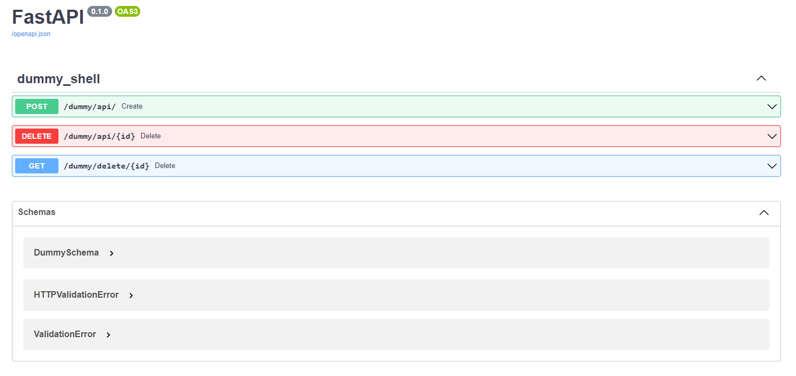

# coopapi
 package for setting up a quick API built on the FastAPI framework

# example
Setup a dummy pydantic dataclass that has some attributes
```buildoutcfg
from pydantic.dataclasses import dataclass as pydandataclass, Field
from cooptools.randoms import a_string, a_phrase

class DummySchemaConfig:
    allow_population_by_field_name = True
    schema_extra = {
        "example": {
            'id': a_string(10),
            'desc': a_phrase(10),
            'active': True,
        }
    }

@pydandataclass(config=DummySchemaConfig)
class DummySchema:
    id: str = Field(...)
    desc: str = Field(...)
    active: bool = Field(...)
```


Using the dummySchema pydantic dataclass, stubb in some callbacks and create the api shell object. This will be used to setup the core funcationality of our API. Create a FastAPI() object that is used to host our router.

Note: multiple routers (shells) can be added to the same FastAPI() object such that you can build out an extensive API.

Finally, serve the app...
```buildoutcfg
from examples.dummySchema import DummySchema
from coopapi import createRequestCallback, ApiShell, deleteRequestCallback
import uvicorn
from fastapi import FastAPI

# create the callbacks for what should be done when the various endpoints are called. This is likely a
# db interaction or a forwarding request.
create_callback: createRequestCallback = lambda r, t: t
delete_callback: deleteRequestCallback = lambda r, t: True

# setup the api itself, use a base FastAPI object and then an api_shell which has its router included in the
# base api
app = FastAPI()
api_shell = ApiShell(target_schema=DummySchema,
                     base_route='/dummy',
                     on_create_callback=create_callback,
                     on_delete_callback=delete_callback)
app.include_router(api_shell.router, tags=["dummy_shell"])


# serve the app
uvicorn.run(app, port=1219)
```

You can visit the docs site of the created api at http://localhost:1219/docs#/

